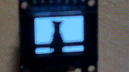

# Bad Apple Juicer

Encode the Bad Apple video in order to decode and display on a microcontroller unit, see `examples/img-test` of [cla7aye15I4nd/awesome-mcu](https://github.com/cla7aye15I4nd/awesome-mcu). 

With lossy compression, the encoder successfully made it under the 128 KiB chip limit to display the 3min39s video in 86 \* 64 \* 8 fps. Lossless compression of 86 \* 64 \* 24 fps costs 465 KiB, which is only 13% of original byte array.

There is also a demo program to display the video using ASCII art in UNIX console.

## Details

### Requirements

If you wish to directly generate headers from video file, you have to install `ffmpeg` and `ffmpy` to decode videos. However, the converted `gif` file is included in `video/`, so you can generate from `gif` directly which only relies on `PIL`.

### How to generate another compression level

Modify the following parameters in both encoder and decoder:

* `interlace`: Each column is refreshed per `interlace` frames. Set to 1 if no interlacing is needed.
* `skip`: Keep one frame in every `skip` frames. Set to 1 if no skipping is needed.

### Technical details of compression

Generally,

* use bitmaps to record changed areas and only keep the differences,
* use interlacing to increase the response time with little cost,
* then reduce the array size by Huffman encoding.

The compression scheme is based on the microcontroller's display, which allows to write a column of 8 pixels at a time using `uint8_t`. So there are exactly 8 chunks per column and the difference of one column can be recorded by a single `uint8_t`, and we just need to record changed chunks in the payload. Similarly we can use some bitmaps to record the changed columns, which is typically not too much by the feature of the video. By such bitmapping, the size of file will increase 1/8 in the worst case (e.g. at the flip of the whole frame), however generally it will cut down about 80% of file size.

The interlacing can double the fps with little size overhead - though phantoms may occur on the boundary. However, phantoms can somehow imitate gray for a binary display, so it's not that annoying.

The Huffman encoding is standard implementation, and generally it can reduce 30~40% even after the above steps of compression.

## Acknowledgement

The author of original project is [cla7aye15I4nd](https://github.com/cla7aye15I4nd).

[wu-qing-157](https://github.com/wu-qing-157) made it possible to output the demo scene using ANSI escape characters efficiently.